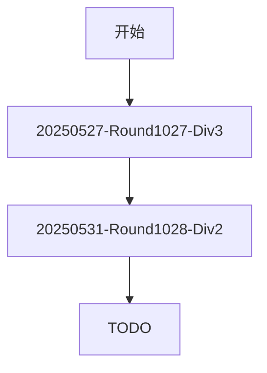

# WA自动机

---

### 过往记录
1. [Codeforces Round 1027 (Div.3)](https://codeforces.com/contest/2114)
2. [牛客小白月赛117](https://ac.nowcoder.com/acm/contest/111309#question)
3. [Codeforces Round 1028 (Div. 2)](https://codeforces.com/contest/2116)
